# Laboratorio 5.1: Creación de un Workflow de GitHub Actions para CI

## 4. Práctica Individual

El estudiante debe reforzar los conocimientos adquiridos aplicándolos a un proyecto propio. Puedes reutilizar la API CRUD desarrollada en laboratorios anteriores o crear una nueva aplicación sencilla.

Previamente creamos un nuevo repositorio denominado github-actions-ci-lab y realizamos la instalación de express:

```
npm init -y
npm install express
npm install --save-dev jest supertest eslint
```

## 1. Crea un nuevo repositorio en GitHub (público o privado) con una aplicación que tenga:

### 1.1 Al menos una entidad de dominio con operaciones CRUD.

Creamos un archivo app.js para películas que capture datos de movie (Nombre de la película), category (Categoría de la película) y stars (Punctuación en estrellas) con el siguiente código adentro:

```
const express = require('express');
const app = express();
app.use(express.json());

let movies= [
  { id: 1, movie: "Superman 2025", category: "Acción", stars: 4 },
  { id: 2, movie: "Siniestro", category: "Terror", stars: 3 },
];

app.get('/movies', (req, res) => {
  res.status(200).json(movies);
});

app.post('/movies', (req, res) => {
  const { movie, category, stars } = req.body;

  if (!movie || !category) {
    return res.status(400).json({ error: "Faltan datos obligatorios" });
  }

  const newItem = {
    id: movies.length + 1,
    movie,
    category,
    stars
  };

  movies.push(newItem);
  res.status(201).json(newItem);
});

app.delete('/movies/:id', (req, res) => {
  const id = parseInt(req.params.id);
  const exists = movies.find(item => item.id === id);

  if (!exists) {
    return res.status(404).json({ error: "Película no encontrada" });
  }

  movies = movies.filter(item => item.id !== id);
  res.status(204).send();
});

module.exports = app;

```

Y el archivo server.js

```
const app = require('./app');
const PORT = 3000;
app.listen(PORT, () => console.log(`Servidor en puerto ${PORT}`));
```

### 1.2. Pruebas unitarias o de integración que cubran las principales funcionalidades.

Ahora procederemos a crear un archivo app.test.js

```
const request = require('supertest');
const app = require('./app');

describe('Pruebas de API Películas', () => {
  test('GET /movies - listar películas', async () => {
    const res = await request(app).get('/movies');
    expect(res.statusCode).toBe(200);
    expect(res.body.length).toBe(2);
  });

  test('POST /movies - crear película', async () => {
    const res = await request(app).post('/movies').send({ movie: "Inception", category: "Sci-Fi" });
    expect(res.statusCode).toBe(201);
  });
});
```

Ahora buscamos el archivo package.json dejandolo de la siguiente forma donde cambiamos la sección de scripts:

```
{
  "name": "github-actions-ci-lab",
  "version": "1.0.0",
  "description": "",
  "main": "app.js",
  "scripts": {
  "test": "jest --coverage",
  "lint": "eslint ."
},
  "keywords": [],
  "author": "",
  "license": "ISC",
  "type": "commonjs",
  "dependencies": {
    "express": "^5.2.1"
  },
  "devDependencies": {
    "eslint": "^10.3.0",
    "jest": "^30.4.2",
    "supertest": "^7.2.2"
  }
}

```

## 2. Configura un workflow de CI completo que incluya:

- Checkout del código.

- Setup del entorno de ejecución (Node.js, Python, Java, etc.).

- Instalación de dependencias.

- Compilación/build (si el lenguaje lo requiere).

- Linting o análisis estático de código.

- Ejecución de pruebas unitarias e integrales.

- Generación de reporte de cobertura (ej. jest --coverage, pytest-cov, jacoco).

Para lograr este paso realizamos el comando de:

```
mkdir -p .github/workflowsiego\github-actions-ci-lab>
```

Y dentro creamos un archivo ci.yml, abrimos el archivo y ponemos el siguiente código con las configuraciones etiquetadas con name en su respectivo orden:

```
name: CI Movies API

on:
  push:
    branches: [main]
  pull_request:
    branches: [main]

jobs:
  build-and-test:
    runs-on: ubuntu-latest
    steps:
      - name: Checkout del Código
        uses: actions/checkout@v6

      - name: Setup del entorno de ejecución Node.js
        uses: actions/setup-node@v6
        with:
          node-version: "20"

      - name: Instalación de las dependencias
        run: npm ci

      - name: Ejecución de Linting
        run: npm run lint

      - name: Ejecución de Pruebas
        run: npm test

      - name: Reporte de Cobertura
        uses: actions/upload-artifact@v4
        with:
          name: cobertura-final
          path: coverage/

```

Ahora guardamos los cambios en el repositorio con:

```
git add .

git commit -m "Inicialización de Api de peliculas con CI"

git push -u origin main

```

## 3. Configura una regla de protección de rama en GitHub para main que:

### 3.1. Requiera que el workflow de CI pase antes de permitir un merge.

Para esto realizamos lo que nos dice la guía que es ir a Settings, Branches y Add Rule, aquí ponemos un nombre al ruleset, seleccionamos la rama main en targets y seleccionamos lo indicado en rules teniendo lo siguiente:
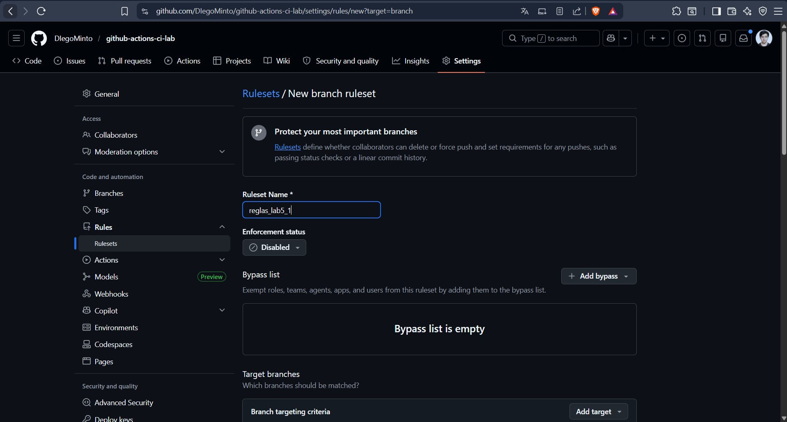
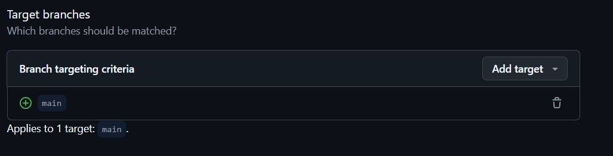
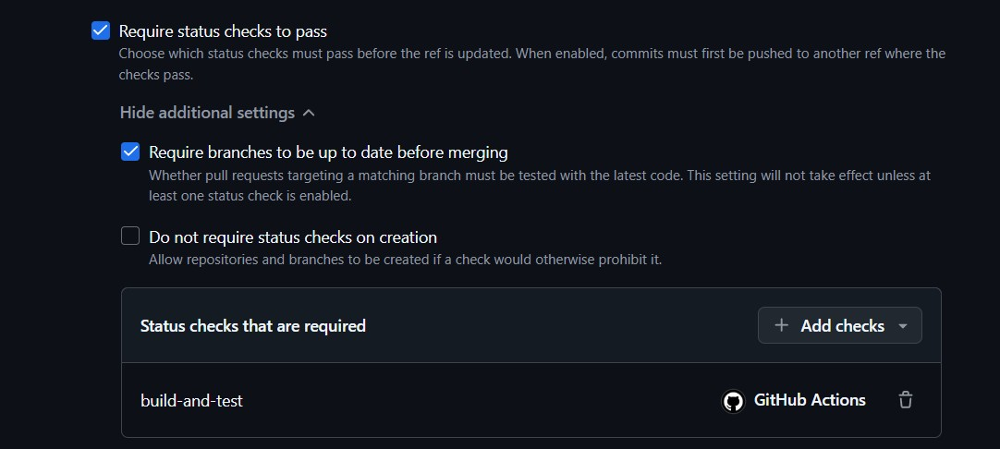

## 4. Crea una pull request desde una rama de feature hacia main, introduce un cambio menor y verifica que:

- El workflow de CI se ejecuta automáticamente.
- GitHub bloquea el merge hasta que el check pase.
- Una vez aprobado, puedes fusionar la rama.

Para esto creamos una nueva rama denominada feature con el siguiente comando:

```
git checkout -b feature/mejora-api
```

Ahora hacemos un cambio en app.js, únicamente ponemos una nueva película:

```
{ id: 2, movie: "Scarface", category: "Acción", stars: 5 }
```

Y subimos la rama con la siguiente secuencia:

```
git add app.js
git commit -m "Verificacion de politicas de seguridad"
git push origin feature/mejora-api
```

Ahora en el repositorio vamos a la sección de pull requests, le damos a new pull request y tendremos que crear el Merge, posteriormente le damos a Merge pull request en la siguiente ventana para fusionar las ramas:
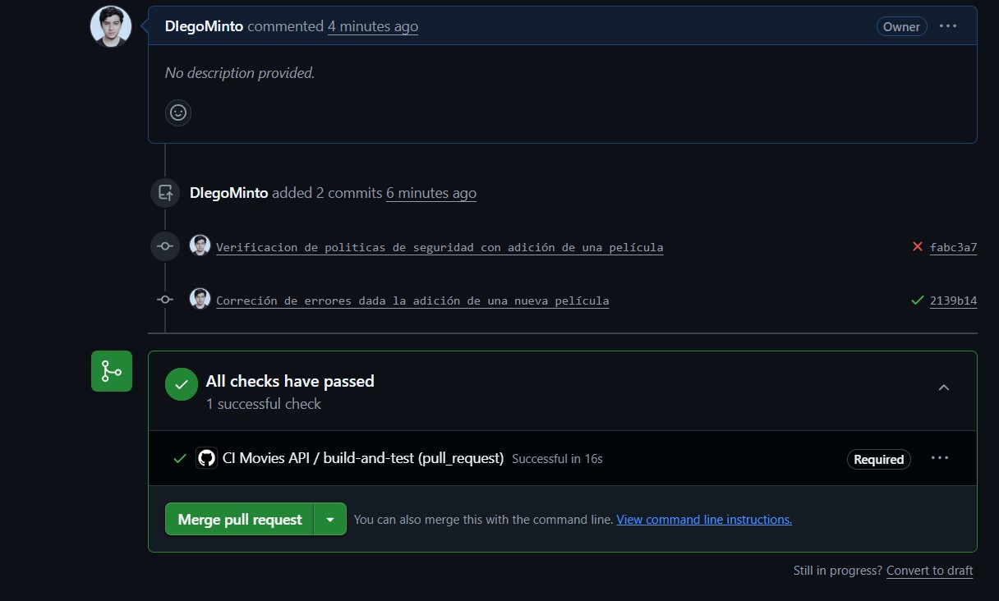
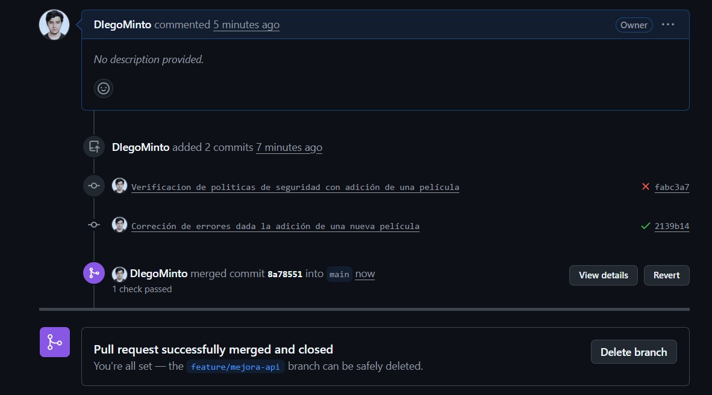

## 5. Dentro del mismo repositorio, crea un archivo INFORME.md en la raíz que contenga:

- El historial de ejecuciones en la pestaña Actions:
  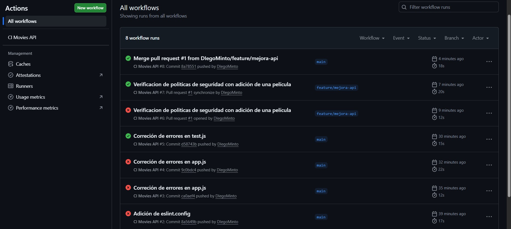
- El detalle de un workflow exitoso con cobertura:
  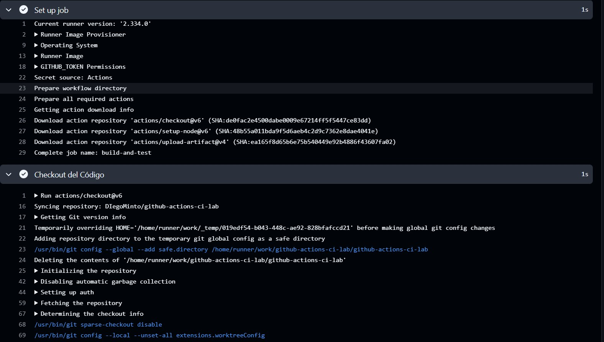
  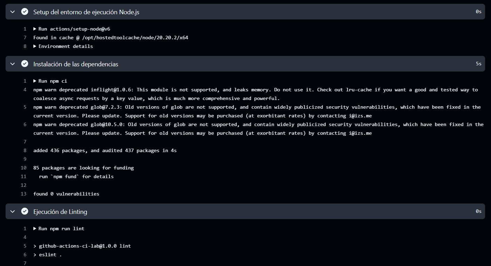
  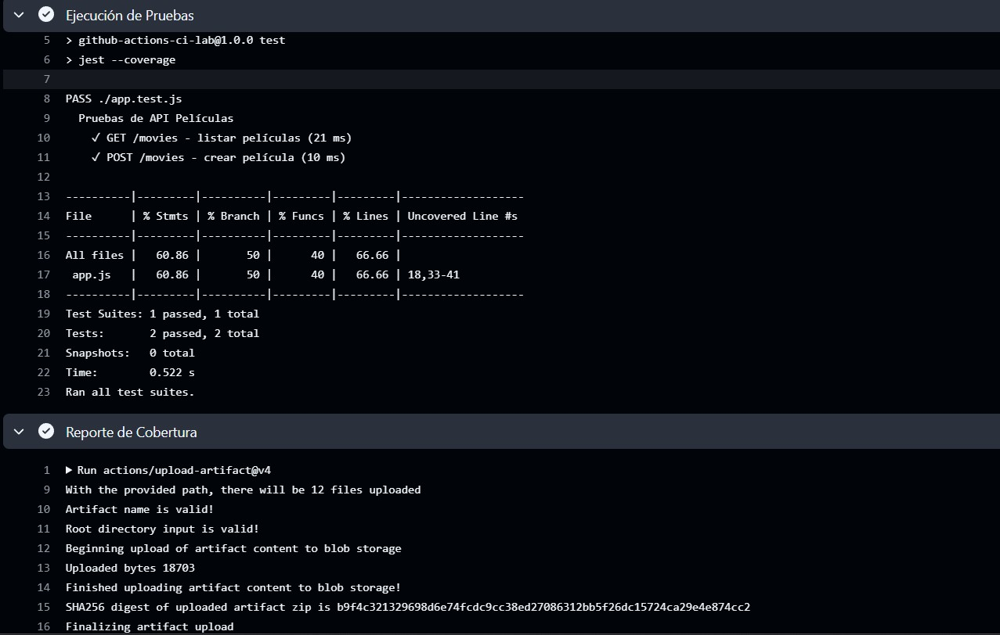
  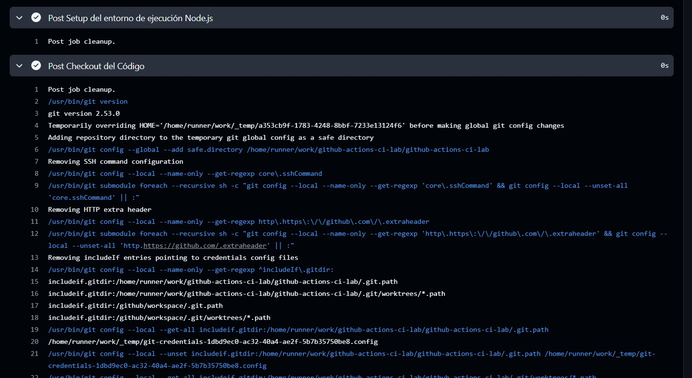
- El detalle de un workflow fallido (puedes forzarlo intencionalmente):
  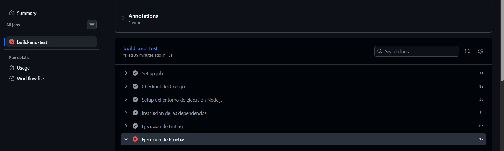
  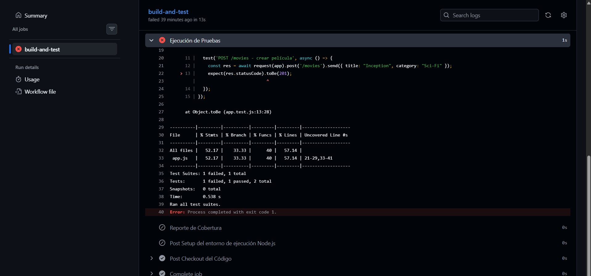

Conclusiones: Tener una integración continua es fundamental pues en el pipeline tenemos las acciones bloqueadas por errores y en un entorno real de trabajo esto es de grana ayuda para evitar errores del equipo así como tener reglas de ramas para asegurarnos que la rama main esté siempre estable y pase por una revisión para que el código pueda ser implementado.

```

```
